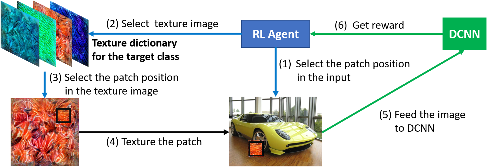

# PatchAttack: A Black-box Texture-based Attack with Reinforcement Learning

<div align="center">
  
</div>

\
A modified fork of the code for the 2020 ECCV paper, *"PatchAttack: A Black-box Texture-based Attack with Reinforcement Learning"* by Chenglin Yang, Adam Kortylewski, Cihang Xie, Yinzhi Cao, and Alan Yuille: [Paper here](https://arxiv.org/abs/2004.05682). Original repository: [Chenglin-Yang/PatchAttack](https://github.com/Chenglin-Yang/PatchAttack).
 
This fork includes compatibility fixes for modern Python/PyTorch versions and a transferability experiment testing whether adversarial examples crafted against one architecture fool others.

Code provided for four patch-based attacks on ImageNet using PyTorch:
- **TPA** (Texture-based Patch Attack) - RL-optimized textured patches using a class-specific texture dictionary
- **MPA** (Monochrome Patch Attack) - RL-optimized solid-colored rectangular patches
- **HPA** (Hastings Patch Attack) - Metropolis-Hastings random sampling with monochrome patches (baseline)
- **AP** (Adversarial Patch) - White-box gradient-crafted patches (baseline)
Each attack can be run through the `PatchAttack_tutorial.ipynb` notebook.

# Step by Step Guide
 
1. Install the packages listed in the Software Installation section (see below).
2. Download the text file of [ImageNet_clsidx_to_labels](https://gist.github.com/yrevar/942d3a0ac09ec9e5eb3a) and save it as `imagenet1000_clsidx_to_labels.txt` in the root directory.
3. For TPA with all 1000 classes: download [TextureDict_ImageNet_0.zip](https://livejohnshopkins-my.sharepoint.com/:u:/g/personal/cyang76_jh_edu/EcKGvE7jQVJMuMxqdbSSYdEB2VLbcE24m6YQDAqb2yR9KA?e=P8RJJm) and [TextureDict_ImageNet_1.zip](https://livejohnshopkins-my.sharepoint.com/:u:/g/personal/cyang76_jh_edu/EXsnVi0FETZJuf1v9CLfu6YByb79RO_vj3-5BV_RY5Wzdg?e=lRUAj1), unzip and merge into a single `TextureDict_ImageNet` folder. For the tutorial demo, this is not required - demo dictionaries for classes 45 and 723 are included in the repo.
4. Open the `PatchAttack_tutorial.ipynb` notebook and run the cells in order.


# Software Installation
 
The original repository was built for Python 3.6, PyTorch 1.4.0, and kornia 0.2.2. This fork has been tested with the following modern versions:
 
| Package | Original | Tested |
|---------|----------|--------|
| Python | 3.6 | 3.14.2 |
| PyTorch | 1.4.0 | 2.10.0+cu126 |
| kornia | 0.2.2 | 0.8.2 |
| easydict | any | 1.13 |
| opencv-python | any | 4.13.0.92 |
| matplotlib | any | 3.10.8 |
| scikit-learn | any | 1.8.0 |
| tqdm | any | 4.67.3 |
| jupyter | any | 1.1.1 |
 
Install dependencies with:
```
pip install torch torchvision easydict opencv-python matplotlib scikit-learn tqdm kornia jupyter
```

# Compatibility Fixes
 
The following changes were made to support modern Python/PyTorch/kornia versions:
 
- **Windows path separators** - Added `.replace('\\', '/')` before `.split('/')` calls in `PatchAttack_config.py` to handle Windows backslash paths.
- **Windows long path support** - Added `\\?\` prefix to `os.makedirs` calls in `PatchAttack_attackers.py` to bypass the 260-character path limit.
- **PyTorch device mismatch** - Added `.cpu()` to boolean filter tensors in `PatchAttack_agents.py` where `area` (CPU) was being indexed by GPU tensors.
- **PyTorch `torch.load` security** - Added `weights_only=False` to `torch.load` calls in `PatchAttack_attackers.py` (PyTorch 2.6+ defaults to `weights_only=True`).
- **kornia API changes** - Replaced `kornia.translate` with `kornia.geometry.transform.translate` in `PatchAttack_attackers.py`.

# System Requirements
 
Tested on Windows 11 with an NVIDIA GPU with CUDA support. The code requires a CUDA-capable GPU - all models and tensors are moved to GPU via `.cuda()` calls.
 
**Windows users:** Enable long path support via registry to avoid path length errors:
```powershell
New-ItemProperty -Path "HKLM:\SYSTEM\CurrentControlSet\Control\FileSystem" -Name "LongPathsEnabled" -Value 1 -PropertyType DWORD -Force
```


# Transferability Experiment
 
Added an experiment to test whether a TPA adversarial image crafted against ResNet50 transfers to other architectures. The adversarial image (targeting class 723, pinwheel) was fed through DenseNet121, MobileNetV2, and VGG19 without modification.
 
| Model | Prediction | Target Conf (723) | GT Conf (547) |
|-------|-----------|-------------------|---------------|
| ResNet50 (target) | electric locomotive (547) | 0.00% | 98.73% |
| DenseNet121 | electric locomotive (547) | 0.00% | 93.24% |
| MobileNetV2 | electric locomotive (547) | 0.00% | 98.44% |
| VGG19 | Gila monster (45) | 0.00% | 0.00% |
 
**Finding:** TPA adversarial images do not transfer across architectures. VGG19 misclassified as class 45 (Gila monster), one of the two classes in the demo texture dictionary, because the texture dictionary is built from VGG19's own Gram matrices.

## Usage

# Data
 
| Data | Description | Size | Required |
|------|-------------|------|----------|
| `TextureDict_demo/` | Demo texture dictionary (classes 45, 723 only) | Small | Included in repo |
| `AdvPatchDict_demo/` | Demo adversarial patch dictionary (classes 45, 723 only) | Small | Included in repo |
| `TextureDict_ImageNet/` | Full texture dictionary (1000 classes × 30 textures) | ~13 GB | Only for full TPA |
| `AdvPatchDict_ImageNet/` | Full adversarial patch dictionary (1000 classes) | Large | Only for full AP |

### Dictionaries
The provided dictionaries are [TextureDict_ImageNet_0.zip](https://livejohnshopkins-my.sharepoint.com/:u:/g/personal/cyang76_jh_edu/EcKGvE7jQVJMuMxqdbSSYdEB2VLbcE24m6YQDAqb2yR9KA?e=P8RJJm), [TextureDict_ImageNet_1.zip](https://livejohnshopkins-my.sharepoint.com/:u:/g/personal/cyang76_jh_edu/EXsnVi0FETZJuf1v9CLfu6YByb79RO_vj3-5BV_RY5Wzdg?e=lRUAj1). Please download, unzip and merge the two into a single folder, constituing the whole texture dictionary used in the [paper](https://arxiv.org/abs/2004.05682). Alternatively, you can also generate one by yourself. First, please provide the paths to the train and val folder of ImageNet dataset and set cfg.ImageNet_train_dir and cfg.ImageNet_val_dir in parser.py. Second, you can optionally adjust the parameters in PatchAttack/PatchAttack_config.py to generate textures in different settings. Then, you can use the following commands to start the generation:

+ Build Texture Dictionary:
```bash
# for classes of a range of labels
python main_build-dict.py --gpu 0 --t-data ImageNet --tdict-dir TextureDict --t-labels-range 0 1000
# for classes of some specific labels
python main_build-dict.py --gpu 0 --t-data ImageNet --tdict-dir TextureDict --t-labels 23 300 900
```

Additionally, a dictionary is provided consisting of Adversarial Patches generated by a gradient-based method proposed in [paper](https://arxiv.org/abs/1712.09665), which is [AdvPatchDict_ImageNet.zip](https://livejohnshopkins-my.sharepoint.com/:u:/g/personal/cyang76_jh_edu/EWnq9xITghhJkbHee9cbl6cByQkDiySr9rMCrh8Z6QulsQ?e=4EZ4Me). This dictionary is generated using VGG19 and other settings are determined in PatchAttack/PatchAttack_config.py. You can change the settings and use the following commands to generate a different dictionary of white-box adversarial patches:

+ Build AdversarialPatch Dictionary
```bash
# for classes of a range of labels
python main_build-dict.py --gpu 0 --arch VGG --depth 19 --t-data ImageNet --dict AdvPatch --tdict-dir AdvPatchDict --t-labels-range 0 1000
# for classes of some specific labels
python main_build-dict.py --gpu 0 --arch VGG --depth 19 --t-data ImageNet --dict AdvPatch --tdict-dir AdvPatchDict --t-labels 23 300 900 
```

### Attacks

The implementation inludes three black-box patch attacks: Texture-based Patch Attack (TPA) and MonoChrome Patch Attack (MPA) proposed in the [paper](https://arxiv.org/abs/2004.05682), as well as the Metropolis-Hastings Attack (HPA) originally proposed in [this paper](http://www.bmva.org/bmvc/2016/papers/paper137/index.html). Also implemented is the white-box Adversarial Patch Attack (AP) orginally proposed in [this paper](https://arxiv.org/abs/1712.09665).
You can add the path to the folder 'PatchAttack' in this repository to PYTHONPATH in your local system and use 'PatchAttack' as a package. 

+ PatchAttack_tutorial.ipynb explains how to perform these attacks. The prerequisite of running this tutorial is to download the text file of [ImageNet_clsidx_to_labels](https://gist.github.com/yrevar/942d3a0ac09ec9e5eb3a) to the root directory of this repository. Please refer to the notebook for details. 

### Defenses:

In the [paper](https://arxiv.org/abs/2004.05682), PatchAttack is evaluted on two defense models: Denoise Network \[[paper](https://arxiv.org/abs/1812.03411) - [code](https://github.com/facebookresearch/ImageNet-Adversarial-Training)\] and Shape-biased Network \[[paper](https://openreview.net/forum?id=Bygh9j09KX) - [code](https://github.com/rgeirhos/texture-vs-shape)\].

## Acknowledgements

The part of Grad_CAM in this code is based on [pytorch-grad-cam](https://github.com/jacobgil/pytorch-grad-cam/blob/master/gradcam.py). A helper function comes from [pytorch-classification](https://github.com/bearpaw/pytorch-classification/blob/master/utils/eval.py).

# Citation
 
Original paper:
```
@article{yang2020patchattack,
  title={PatchAttack: A Black-box Texture-based Attack with Reinforcement Learning},
  author={Yang, Chenglin and Kortylewski, Adam and Xie, Cihang and Cao, Yinzhi and Yuille, Alan},
  journal={arXiv preprint arXiv:2004.05682},
  year={2020}
}
```
 
# License
 
This project is licensed under the MIT License - see the [LICENSE](LICENSE) file for details.
